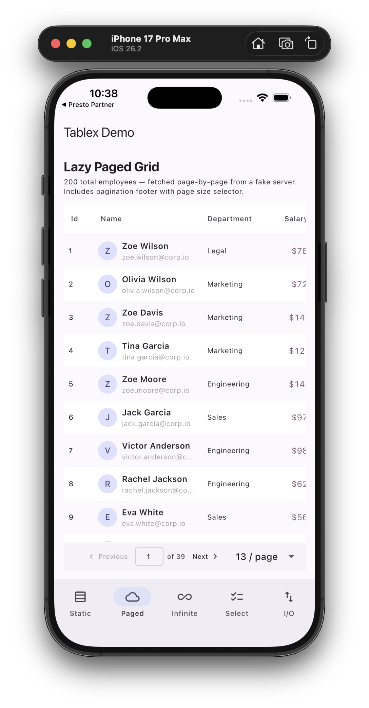
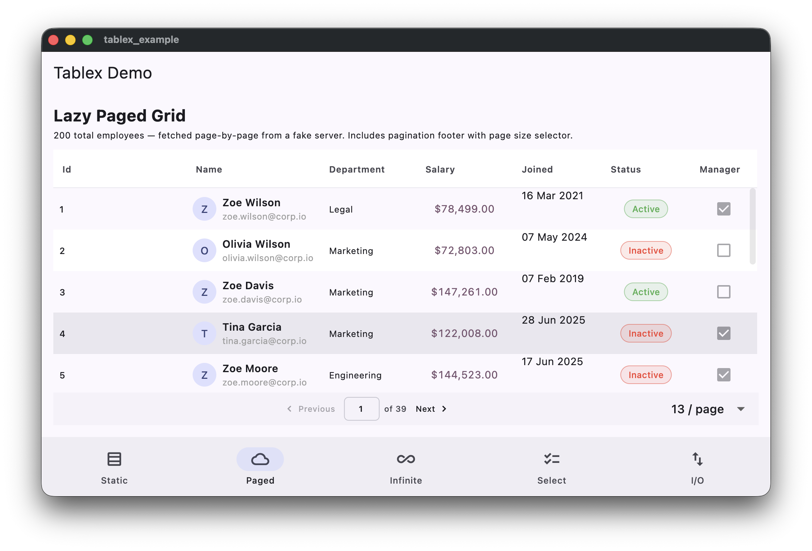
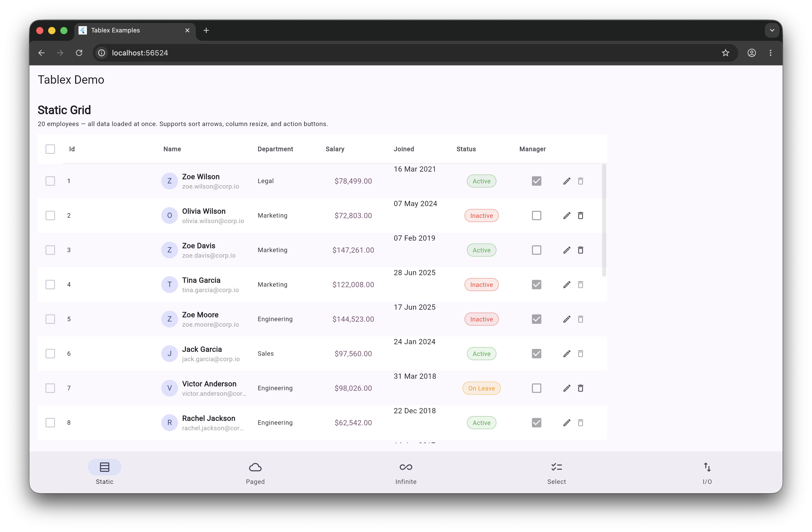

# tablex

A production-grade Flutter data grid with no dependency on any third-party grid engine.

---

## Screenshots

|            iOS             | macOS |
|:--------------------------:|:---:|
|  |  |



---

## Features

- **Four grid modes** — static in-memory, lazy-paged (server-side), infinite-scroll, and select-picker
- **Sliding-window infinite scroll** — only keeps a configurable number of pages in memory; evicts old pages as the user scrolls, with seamless scroll-position compensation
- **Skeleton loading** — pre-populate the grid with placeholder rows that shimmer while the first page loads
- **Column management** — resizable, sortable, reorderable headers; show/hide via column manager
- **Row selection** — single or multi-select with a customisable summary bar and bulk-action buttons
- **Built-in cell renderers** — identifier, two-line, avatar+two-line, currency, date, status chip, action buttons
- **CSV & Excel export/import** — built-in toolbar with formula-injection protection
- **Density presets** — `compact`, `standard`, `comfortable`
- **Column groups** — spanning header labels across multiple columns
- **Theming** — full override via `TablexThemeData` or inherit from Material 3
- **i18n** — locale strings via `slang` (override to ship your own language)
- Zero third-party grid engine dependency

---

## Getting started

```yaml
dependencies:
  tablex: ^0.4.0
```

---

## Usage

### TablexConsumer — recommended for server-paginated data

`TablexConsumer` is the highest-level widget. It wraps `Tablex.lazyPaged` and adds a rounded bordered container, an optional title/filter header slot, automatic filter-chip rendering, and a selection summary bar. A `TablexController` is created and disposed for you unless you supply your own.

```dart
TablexConsumer<Employee>(
  columns: [
    TablexColumn<Employee, String>(
      fieldKey: 'name',
      title: 'Name',
      width: 180,
      valueGetter: (e) => e.name,
    ),
    TablexColumn<Employee, double>(
      fieldKey: 'salary',
      title: 'Salary',
      width: 130,
      textAlign: TextAlign.end,
      valueGetter: (e) => e.salary,
      cellRenderer: TablexRenderers.currency(symbol: '\$'),
    ),
  ],
  fetchTask: (query) async {
    final resp = await api.getEmployees(
      page: query.page,
      pageSize: query.pageSize,
      sort: query.sort?.field,
      sortAsc: query.sort?.direction == TablexSortDirection.ascending,
    );
    return TablexFetchResult(rows: resp.items, totalRows: resp.total);
  },
  initialPageSize: 13,
  tableHeader: const Text('Employees', style: TextStyle(fontWeight: FontWeight.bold)),
)
```

#### Optional header & filter slots

```dart
TablexConsumer<Employee>(
  // ...
  tableHeader: Row(
    children: [
      const Text('Employees'),
      const Spacer(),
      TablexToolbar<Employee>(controller: _controller, columns: _columns),
    ],
  ),
  tableFilter: MySearchField(onChanged: (v) => _controller.setParam('q', v)),
)
```

#### Skeleton loading

Pre-populate with placeholder rows until the first real page arrives:

```dart
TablexConsumer<Employee>(
  // ...
  loadingBuilder: TablexLoadingBuilder(
    skeletonData: List.generate(13, (_) => Employee.placeholder()),
    builder: (context, table) => Skeletonizer(enabled: true, child: table),
  ),
)
```

#### Custom pagination footer

```dart
TablexConsumer<Employee>(
  // ...
  enablePageJump: true, // editable page-number field
  footerBuilder: (context, info) => Row(
    children: [
      Text('Page ${info.page} of ${info.totalPages}'),
      IconButton(
        icon: const Icon(Icons.chevron_right),
        onPressed: info.nextPage,
      ),
    ],
  ),
)
```

---

### Tablex.static — in-memory grid

All rows are provided upfront. Sorting is handled client-side.

```dart
Tablex<Employee>.static(
  columns: columns,
  rows: employees,
  rowBuilder: (e) => TablexRow(
    data: e,
    key: e.id.toString(),
    cells: {'name': e.name, 'salary': e.salary},
  ),
)
```

---

### Tablex.lazyPaged — server-side pagination

Fetches one page at a time. The built-in pagination footer handles page navigation, page-size selection, and a page cache (up to 10 pages cached to avoid re-fetching on back-navigation).

```dart
Tablex<Employee>.lazyPaged(
  columns: columns,
  fetchTask: (query) async {
    final result = await api.fetchPage(
      page: query.page,
      pageSize: query.pageSize,
      sortField: query.sort?.field,
      sortAsc: query.sort?.direction == TablexSortDirection.ascending,
    );
    return TablexFetchResult(rows: result.items, totalRows: result.total);
  },
  rowBuilder: rowBuilder,
  initialPageSize: 20,
)
```

---

### Tablex.infinite — infinite scroll with sliding window

New pages are fetched automatically as the user scrolls toward the bottom. A configurable sliding window (`windowPages`) keeps only that many pages in memory at once — old pages are evicted as new ones arrive, and the scroll position is compensated so the viewport never jumps.

```dart
Tablex<Employee>.infinite(
  columns: columns,
  fetchTask: (query) async {
    final result = await api.fetchPage(
      page: query.page,
      pageSize: query.pageSize,
    );
    return TablexFetchResult(rows: result.items, totalRows: result.total);
  },
  rowBuilder: rowBuilder,
  fetchSize: 50,
  windowPages: 5,        // keep at most 5 pages in memory
  loadingBuilder: TablexLoadingBuilder(
    skeletonData: List.generate(15, (_) => Employee.placeholder()),
    builder: (context, table) => Skeletonizer(enabled: true, child: table),
  ),
)
```

Sorting resets the scroll position, clears all loaded pages, and re-fetches from page 1 — stale in-flight requests are discarded via a generation counter so no data races occur.

---

### Tablex.select — picker / combobox

Turns the grid into a single or multi-select picker. Density defaults to `compact`.

```dart
Tablex<Country>.select(
  columns: countryColumns,
  rows: countries,
  rowBuilder: countryRowBuilder,
  multiSelect: true,
  onSelectionChanged: (selected) => setState(() => _picked = selected),
)
```

---

## TablexController

The controller is optional — each widget creates its own unless you pass one. Provide your own when you need to drive the grid from outside.

```dart
final _controller = TablexController<Employee>();

// Refresh (re-fetches current page, invalidates the page cache)
_controller.refresh();

// Pass arbitrary params to fetchTask
_controller.setParam('status', 'active');

// Programmatic navigation
_controller.goToPage(3);
_controller.nextPage();
_controller.previousPage();

// Sort
_controller.setSort(const TablexColumnSort(
  field: 'name',
  direction: TablexSortDirection.ascending,
));

// Row manipulation (useful for optimistic updates)
_controller.updateRow(0, updatedEmployee, rowBuilder: rowBuilder);
_controller.removeRow(0);

// Export
final csv = _controller.exportToCsv(columns);

// Selection
_controller.selectAll(_controller.getAllRowData());
_controller.clearSelection();
```

Do not forget to dispose the controller when you own it:

```dart
@override
void dispose() {
  _controller.dispose();
  super.dispose();
}
```

---

## Column definitions

### TablexColumn

```dart
TablexColumn<Employee, String>(
  fieldKey: 'name',   // must match the key in TablexRow.cells
  title: 'Name',
  width: 180,
  minWidth: 80,
  enableSorting: true,
  enableFiltering: true,
  textAlign: TextAlign.start,
  cellRenderer: TablexRenderers.twoLine(secondLine: (e) => e.email),
)
```

### Column groups

Span a header label across multiple columns:

```dart
Tablex<Employee>.lazyPaged(
  columns: columns,
  columnGroups: [
    TablexColumnGroup(
      title: 'Personal',
      fieldKeys: ['firstName', 'lastName', 'email'],
    ),
    TablexColumnGroup(
      title: 'Compensation',
      fieldKeys: ['salary', 'bonus'],
    ),
  ],
  // ...
)
```

---

## Built-in renderers

| Renderer | Description |
|---|---|
| `TablexRenderers.identifier()` | Monospaced ID / UUID chip |
| `TablexRenderers.twoLine(secondLine: ...)` | Primary text + dimmed secondary line |
| `TablexRenderers.avatarTwoLine(avatar: ..., secondLine: ...)` | Circular avatar + two lines |
| `TablexRenderers.currency(symbol: '\$', decimals: 2)` | Right-aligned number with currency symbol |
| `TablexRenderers.date(format: ...)` | Formatted `DateTime` |
| `TablexRenderers.statusChip(colors: ..., labels: ...)` | Rounded coloured chip |
| `TablexRenderers.actions(actions: ...)` | Row of icon buttons |

---

## Toolbar (export & import)

`TablexToolbar` gives you column-visibility management, CSV export, Excel export, CSV import, and Excel import as a single drop-in widget.

```dart
TablexConsumer<Employee>(
  tableHeader: TablexToolbar<Employee>(
    controller: _controller,
    columns: _columns,
    // Enable import by providing a factory that parses one CSV/Excel row
    importRowFactory: (map) => TablexRow(
      data: Employee.fromMap(map),
      key: map['id'],
      cells: {'name': map['name']!, 'salary': double.parse(map['salary']!)},
    ),
  ),
  // ...
)
```

Override individual actions while keeping the rest:

```dart
TablexToolbar<Employee>(
  controller: _controller,
  columns: _columns,
  onExportCsv: (csv) async => await api.uploadCsv(csv),
  onExportExcel: (bytes) async => await FileSaver.saveFile(bytes),
)
```

---

## Row selection & bulk actions

```dart
Tablex<Employee>.static(
  // ...
  selectionMode: TablexSelectionMode.multiple,
  showSelectionSummary: true,
  selectionActions: [
    TablexSelectionAction<Employee>(
      label: 'Delete selected',
      icon: Icons.delete_outline,
      onPressed: (selected) => _bulkDelete(selected),
    ),
  ],
)
```

Replace the entire summary bar with a custom widget:

```dart
selectionSummaryBuilder: (context, selected, clearSelection) => ColoredBox(
  color: Theme.of(context).colorScheme.primaryContainer,
  child: Row(children: [
    Text('${selected.length} selected'),
    const Spacer(),
    TextButton(onPressed: clearSelection, child: const Text('Clear')),
  ]),
),
```

---

## Theming

All colours fall back to the ambient Material 3 `ColorScheme` when not set. Override only what you need:

```dart
Tablex<Employee>.static(
  theme: const TablexThemeData(
    showVerticalCellBorders: false,
    borderRadius: BorderRadius.all(Radius.circular(12)),
    checkboxTheme: TablexCheckboxTheme(
      activeColor: Colors.indigo,
      checkColor: Colors.white,
      size: 18,
    ),
  ),
  // ...
)
```

Alternatively, wrap your subtree with `TablexTheme` to apply a theme to all grids in scope:

```dart
TablexTheme(
  data: const TablexThemeData(showVerticalCellBorders: true),
  child: MyScreen(),
)
```

---

## Additional information

- [Source & issues](https://github.com/weaamokok/tablex)
- PRs and bug reports are welcome.
